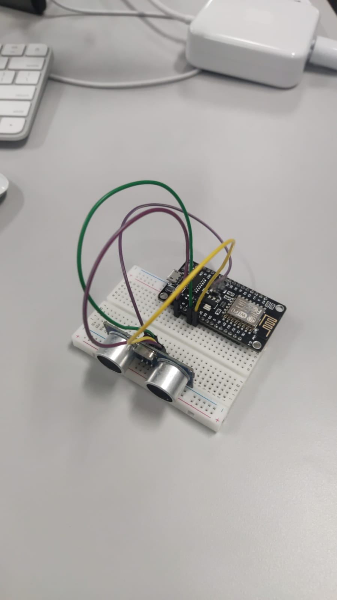

# pa-praktikum-iot-unmul-c1
<ul>
<li>Indro Dwi Saputro 2009106099
<li>Yusuf Adi Iswanto 2009106148
<li>Asyhab Ramadhan 2009106145
</ul>

# Monitoring dan Kontroling Pengukur Jarak Bamper Mobil Belakang Menggunakan Sensor Ultrasonik
Pada proyek ini, kami mengangkat tema “Monitoring dan Kontroling Pengukur Jarak Bamper Mobil Belakang Menggunakan Sensor Ultrasonik”, yang dimana nantinya alat ini berfungsi ketika sebuah mobil hendak parkir dan berhadapan dengan suatu objek yang menghadang bamper, otomatis alat ini akan memberi sinyal dengan bunyi (buzzer) semakin dekat mobil maka semakin nyaring bunyi buzzer, dengan menggunakan Sensor Ultrasonik mempermudah kelompok kami untuk mengatur jarak antara mobil dengan suatu objek yang menghadang bamper mobil.

# Komponen Yang Digunakan
## Publisher
<ul>
<li>NodeMCU
<li>BreadBoard
<li>Sensor Ultrasonik
<li>Kabel Jumper
</ul>
<h2> Subscriber </h2>
<ul>
<li>NodeMCU
<li>BreadBoard
<li>Buzzer
<li>Kabel Jumper
</ul>
# Ilustrasi Alur Sistem

# Board Schematic
## Publisher

## Subscriber

